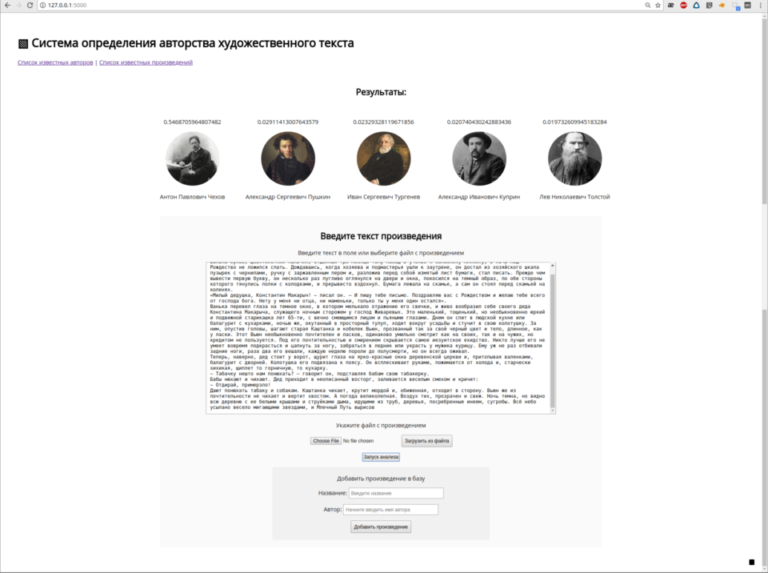
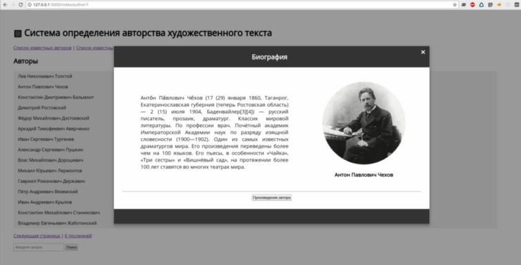

## Определение авторства художественного текста(*модуль 2*)

#### Язык:
  - Python 3.6

#### Основные библиотеки :
  - Keras(TensorFlow)
  - Scikit learn
  - Flask
  - Grab
  - Mystem
  - Pandas
  - NumPy

БД:
  - MySQL

#### Источники данных:
  - loveread.ec 
  - ru.wikisource.org
  
_________

[Модуль 1](https://github.com/Pichenug/author_identification1)
